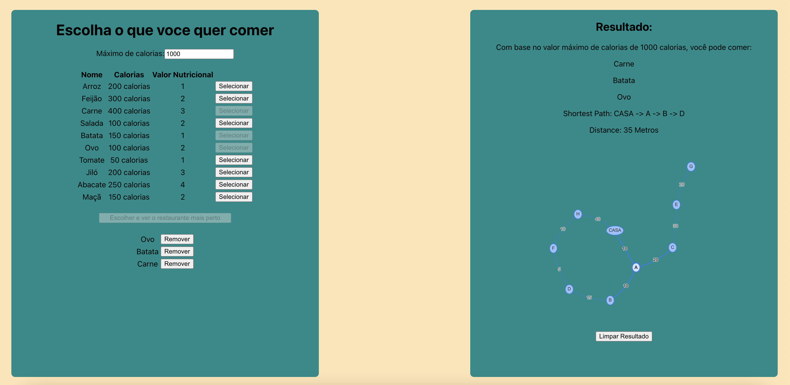
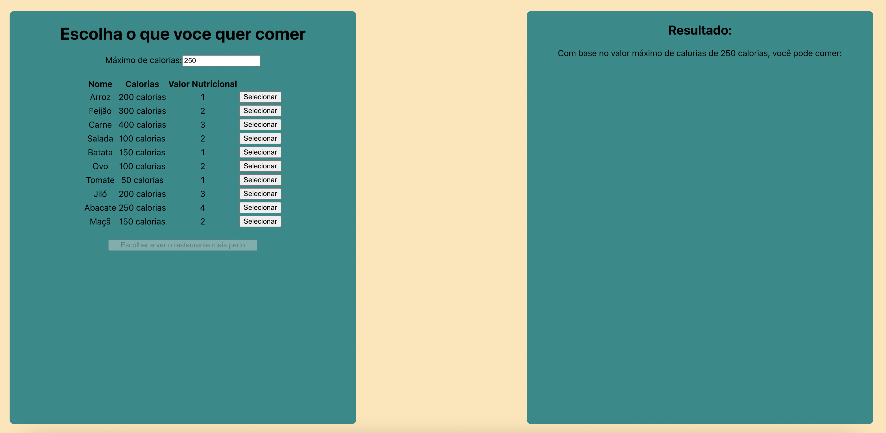
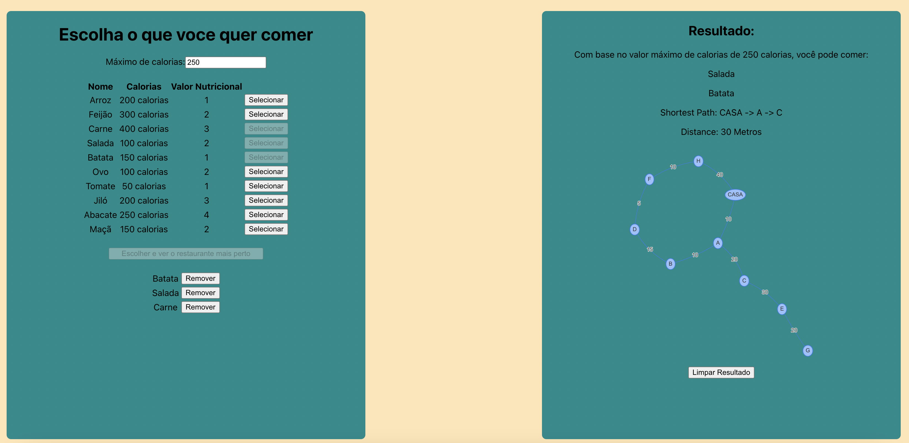

Temas:

- Grafos2
- PD

# Caminho da Dieta

**Número da Lista**: 2, 5<br>
**Conteúdo da Disciplina**: Grafos 2 e Programação dinâmica<br>

## Alunos

| Matrícula | Aluno                         |
| --------- | ----------------------------- |
| 180011600 | Ailton Aires Amado            |
| 180042386 | Kevin Luis Apolinario Batista |

## Sobre

O objetivo principal do projeto final é utlizar o altoritmo knapsack estudado em programação dinâmica juntamente com o melhor caminho utilizando dijkstra. O cenário é de uma pessoa que quer escolher ingredientes e também um máximo de calorias para aquela refeição, após a escolha ela quer saber o melhor caminho até o restaurante mais proximo que tenha esses ingredientes.

## Screenshots





## Instalação

**Linguagem**: Javascript, HTML e CSS<br>
**Framework**: React Js<br>

- node.js >= 16

## Uso

Para rodar o projeto utilize os comandos:

```
git clone https://github.com/projeto-de-algoritmos/Final_CaminhoDaDieta.git
```

```
cd Final_CaminhoDaDieta
```

```
npm install
```

```
npm start
```

O projeto estará rodando em: http://localhost:3000

## Outros

Escolha as opcoes de ingredientes e clique no botao para mostrar a melhor combinacao e o menor caminho até o restaurante que tenha todas, ou a maioria, das opções.
